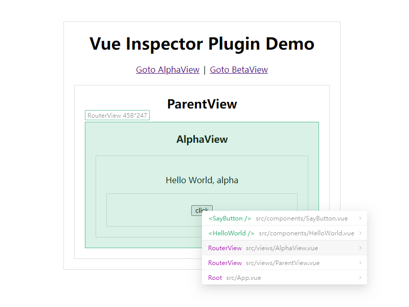

# vue-inspector-plugin

A webpack plugin implements automatically open corresponding file in vscode when click element in browser.

> It supports webpack 4 and 5.

## Installation

```bash
npm install --save-dev vue-inspector-plugin
```

## Usage

```js
// vue.config.js
const VueInspectorPlugin = require('vue-inspector-plugin');

module.exports = {
  chainWebpack(config) {
    if (process.env.NODE_ENV === 'development') {
      config.plugin('VueInspectorPlugin').use(new VueInspectorPlugin());
    }
  },
};
```

## Options

- rootDir: The directory where `src` resides, defaults to `process.cwd()`.
- modifierKey: The modifier key that should be pressed at the same time when clicking, defaults to `ctrl`.

## Snapshot


