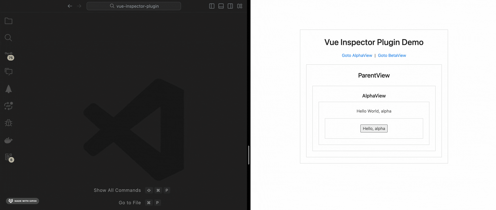

# vue-inspector-plugin

A plugin implements automatically open corresponding file in vscode when click element in browser.

## Compatibility

|           | vue 2 | vue 3 |
| --------- | ----- | ----- |
| vite      | ✅    | ✅    |
| webpack 4 | ✅    | ✅    |
| webpack 5 | ✅    | ✅    |

## Installation

```bash
npm install --save-dev vue-inspector-plugin
```

## Usage

- Vite

```js
// vite.config.js
import { defineConfig } from 'vite';
import VueInspector from 'vue-inspector-plugin/vite';
import Vue from '@vitejs/plugin-vue';

export default defineConfig({
  plugins: [Vue(), VueInspector()],
});
```

- Webpack

```js
// vue.config.js
const VueInspector = require('vue-inspector-plugin/webpack').default;

module.exports = {
  chainWebpack(config) {
    config.plugin('VueInspector').use(VueInspector());
  },
};
```

## Options

- rootDir: The directory where `src` resides, defaults to `process.cwd()`.
- modifierKey: The modifier key that should be pressed at the same time when clicking, defaults to `ctrl`.

## Snapshot


